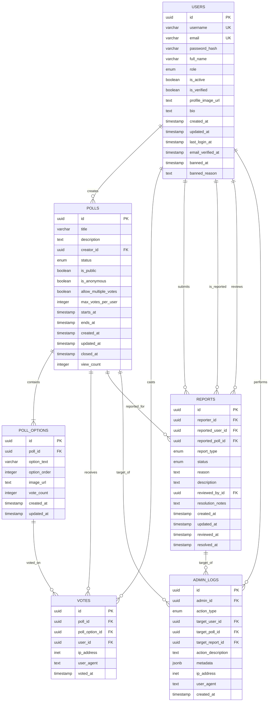

# Entity Relationship Diagram (ERD)

## Database Schema for Polling System

This document contains the Entity Relationship Diagram for the PostgreSQL database schema.

### Mermaid ERD

## Relationship Details

### One-to-Many Relationships

1. **USERS → POLLS** (creates)
   - One user can create multiple polls
   - Field: `polls.creator_id` → `users.id`
   - Cascade: ON DELETE CASCADE

2. **USERS → VOTES** (casts)
   - One user can cast multiple votes
   - Field: `votes.user_id` → `users.id`
   - Cascade: ON DELETE SET NULL (to preserve vote records)

3. **USERS → REPORTS** (submits)
   - One user can submit multiple reports
   - Field: `reports.reporter_id` → `users.id`
   - Cascade: ON DELETE SET NULL

4. **USERS → REPORTS** (is_reported)
   - One user can be reported multiple times
   - Field: `reports.reported_user_id` → `users.id`
   - Cascade: ON DELETE CASCADE

5. **USERS → REPORTS** (reviews)
   - One admin/moderator can review multiple reports
   - Field: `reports.reviewed_by_id` → `users.id`
   - Cascade: ON DELETE SET NULL

6. **USERS → ADMIN_LOGS** (performs)
   - One admin can perform multiple actions
   - Field: `admin_logs.admin_id` → `users.id`
   - Cascade: ON DELETE SET NULL

7. **POLLS → POLL_OPTIONS** (contains)
   - One poll contains multiple options
   - Field: `poll_options.poll_id` → `polls.id`
   - Cascade: ON DELETE CASCADE

8. **POLLS → VOTES** (receives)
   - One poll can receive multiple votes
   - Field: `votes.poll_id` → `polls.id`
   - Cascade: ON DELETE CASCADE

9. **POLLS → REPORTS** (reported_for)
   - One poll can be reported multiple times
   - Field: `reports.reported_poll_id` → `polls.id`
   - Cascade: ON DELETE CASCADE

10. **POLL_OPTIONS → VOTES** (voted_on)
    - One poll option can be voted on multiple times
    - Field: `votes.poll_option_id` → `poll_options.id`
    - Cascade: ON DELETE CASCADE

11. **POLLS → ADMIN_LOGS** (target_of)
    - One poll can be the target of multiple admin actions
    - Field: `admin_logs.target_poll_id` → `polls.id`
    - Cascade: ON DELETE SET NULL

12. **REPORTS → ADMIN_LOGS** (target_of)
    - One report can be the target of multiple admin actions
    - Field: `admin_logs.target_report_id` → `reports.id`
    - Cascade: ON DELETE SET NULL

## Key Features

### Constraints
- **Unique Constraints**: Username, email, user vote per option
- **Check Constraints**: Email format, username length, valid date ranges
- **Foreign Key Constraints**: All relationships properly defined with appropriate cascade rules

### Indexes
- Primary key indexes on all tables
- Foreign key indexes for query optimization
- Composite indexes for common query patterns
- Partial indexes for filtering active records

### Triggers
- Auto-update `updated_at` timestamps
- Auto-update vote counts on poll_options
- Validate poll status transitions
- Set closed_at timestamp when poll is closed

### Views
- `active_polls_summary`: Summary of active polls with vote counts
- `poll_results`: Poll results with vote percentages
- `user_statistics`: User activity statistics

## Data Types and Enumerations

### Custom Types (ENUMs)

1. **user_role**: `user`, `moderator`, `admin`
2. **poll_status**: `draft`, `active`, `closed`, `archived`
3. **report_status**: `pending`, `reviewed`, `resolved`, `dismissed`
4. **report_type**: `poll`, `comment`, `user`, `other`
5. **admin_action_type**: Various administrative actions

### Special Data Types
- **UUID**: Used for all primary keys for better distribution and security
- **TIMESTAMP WITH TIME ZONE**: All timestamps include timezone information
- **INET**: IP addresses for vote tracking and audit logs
- **JSONB**: Flexible metadata storage in admin_logs

## Security Considerations

1. **Password Storage**: Uses password_hash column (should use bcrypt/Argon2)
2. **Soft Deletes**: Some foreign keys use SET NULL to preserve data integrity
3. **Audit Trail**: Admin_logs table tracks all administrative actions
4. **IP Tracking**: Votes and admin actions record IP addresses for fraud detection
5. **User Verification**: Email verification flag for account security

## Scalability Considerations

1. **Indexed Foreign Keys**: All foreign keys are indexed for join performance
2. **Materialized Views**: Can be added for heavy reporting queries
3. **Partitioning**: Tables like votes and admin_logs can be partitioned by date
4. **Vote Count Caching**: Denormalized vote_count on poll_options for performance
5. **View Count**: Cached on polls table instead of counting relationships
